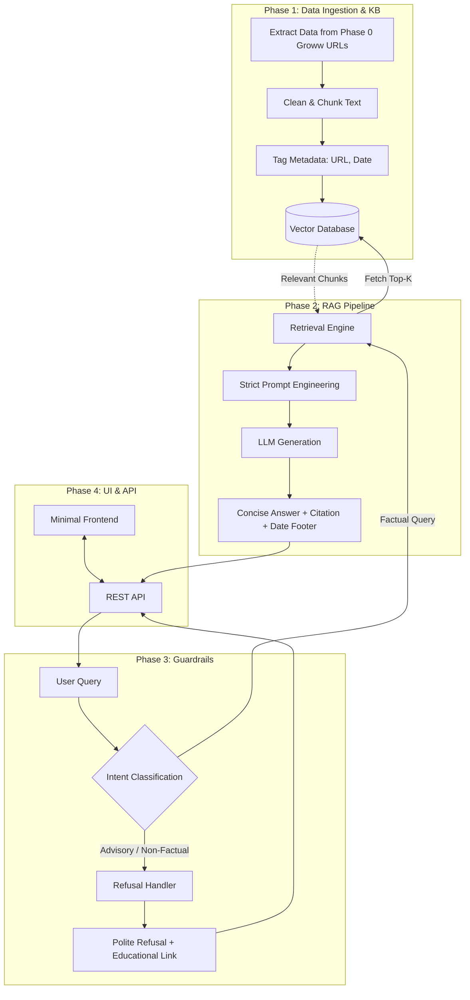

# Phase-Wise Architecture: Mutual Fund FAQ Assistant (Facts-Only Q&A)

Based on the problem statement requirements, here is the detailed phase-wise architecture for building the lightweight Retrieval-Augmented Generation (RAG)-based FAQ assistant.

## Phase 0: Project Context & Reference URLs
**Objective:** Define the specific mutual fund schemes from Groww to be used as reference context for this project.

* **Selected AMC:** HDFC Mutual Fund
* **Target Schemes (Groww Reference URLs):**
  * [HDFC Mid-Cap Fund](https://groww.in/mutual-funds/hdfc-mid-cap-fund-direct-growth)
  * [HDFC Equity Fund (Flexi Cap)](https://groww.in/mutual-funds/hdfc-equity-fund-direct-growth)
  * [HDFC Small Cap Fund](https://groww.in/mutual-funds/hdfc-small-cap-fund-direct-growth)
  * [HDFC Large Cap Fund](https://groww.in/mutual-funds/hdfc-large-cap-fund-direct-growth)
  * [HDFC Gold ETF Fund of Fund](https://groww.in/mutual-funds/hdfc-gold-etf-fund-of-fund-direct-plan-growth)
  * [HDFC Nifty 50 Index Fund](https://groww.in/mutual-funds/hdfc-nifty-50-index-fund-direct-growth)

## Phase 1: Data Ingestion & Knowledge Base Preparation
**Objective:** Collect and prepare data strictly from the Groww reference URLs defined in Phase 0.

### Phase 1.1: Web Scraping & Data Extraction
* Extract HTML data exclusively from the 6 Groww mutual fund URLs listed in Phase 0. No other external documents, factsheets, KIMs, SIDs, or AMFI/SEBI pages will be used.

### Phase 1.2: Data Cleaning & Chunking
* Process the extracted HTML content from the Groww URLs. Clean the text to remove noise (navbars, footers) and divide it into logical, overlapping chunks to ensure context isn't lost during retrieval.

### Phase 1.3: Metadata Tagging
* Crucially, tag each chunk with its source URL and the "last updated" date. This metadata is strictly required for the response citations.

### Phase 1.4: Embedding Generation & Vector DB Setup
* Generate embeddings for the chunks using an embedding model and store them in a lightweight vector database (e.g., ChromaDB, FAISS).

### Phase 1.5: Automated Ingestion Scheduler
* Implement a **GitHub Actions** workflow to periodically run the scraping, cleaning, and embedding scripts on a CRON schedule. This ensures the vector database always contains the latest daily NAVs and factual data from the Groww URLs without manual intervention.

## Phase 2: RAG Pipeline Development (Retrieval & Generation)
**Objective:** Build the core logic for answering factual queries accurately and concisely.

* **Retrieval Engine (Metadata Pre-Filtering + Top-K):** When a query is received, first extract the target mutual fund name. Use this to pre-filter the vector database, isolating only chunks from that specific scheme. Then, generate the query's embedding and retrieve the top-K most relevant chunks from that filtered subset to guarantee zero cross-fund hallucination.
* **Strict Prompt Engineering:** Construct a rigid prompt template for the LLM that enforces the constraints:
  * Answer using *only* the retrieved context.
  * Limit the response to a maximum of **3 sentences**.
  * Append exactly **one citation link** sourced from the metadata.
  * Append the exact footer: `"Last updated from sources: <date>"`.
* **LLM Generation:** Pass the prompt to **Groq (using Llama-3-70b)**, a highly capable open-source model running on ultra-fast LPUs, to synthesize the final response based solely on the retrieved chunks.

## Phase 3: Compliance & Refusal Guardrails
**Objective:** Ensure the assistant provides absolutely no investment advice or opinions.

* **Query Intent Classification:** Implement an initial routing/guardrail step before the RAG pipeline. This can be a fast LLM classifier or strict semantic router that detects advisory intents (e.g., "Should I buy...", "Which is better...", "Compare returns...").
* **Refusal Handler:** If a query is flagged as non-factual, advisory, or out-of-box, bypass the RAG pipeline entirely and return a standard, polite refusal.
  * **Strict Rule:** We will NOT provide any external reference links to the user for out-of-box or refused questions.
  * *Example Response:* "I can only provide factual information about mutual funds. I cannot offer investment advice or answer unrelated queries."
* **Privacy Controls:** Ensure the application does not prompt for or process any PII (PAN, Aadhaar, account numbers).

## Phase 4: User Interface & Deployment
**Objective:** Deliver a clean, minimal interface for target users (retail investors and support teams).

* **Backend Service:** Expose the complete pipeline (Guardrails -> Retrieval -> Generation) via a lightweight REST API using FastAPI or Flask.
* **Minimal UI:** Build a simple frontend (using Streamlit or a basic React/Vite app) that includes:
  * A clear Welcome Message.
  * 3 clickable Example Questions to guide users on what they can ask.
  * A highly visible Disclaimer: `"Facts-only. No investment advice."`
* **Deliverables Generation:** Compile the `README.md` with setup instructions, selected AMC/schemes, the architecture overview, and known limitations.

## Phase 5: Retro Space UI (Groww AI Navigator)
**Objective:** Enhance the user experience with a premium, gamified frontend design based on the "Deep Space AI" aesthetic generated by Google Stitch.

* **Frontend Theme:** Implements a dark-mode deep space grid with a neon-glow primary color scheme (Groww's `#00d09c`).
* **Design Features:** Incorporates a static starfield, glassmorphic chat panels, a retro terminal input field, and a persistent "Facts-only" disclaimer badge.
* **Tech Stack:** Vanilla HTML/JS with Tailwind CSS loaded via CDN.

## Phase 6: Production Deployment (Finalized)

The application has been successfully decoupled and deployed as a distributed system:

### 1. Frontend (Vercel)
- **Deployment Type**: Static Site
- **Live URL**: [https://milestone2-tan-two.vercel.app](https://milestone2-tan-two.vercel.app)
- **Key Features**: 
    - Retro Space UI with glassmorphic components.
    - Asynchronous communication with the Railway backend.
    - Character encoding optimized for production.

### 2. Backend (Railway)
- **Deployment Type**: FastAPI (Python)
- **Live URL**: [https://web-production-bdd61.up.railway.app](https://web-production-bdd61.up.railway.app)
- **Infrastructure**:
    - **Nixpacks**: Auto-detects Python environment from root `requirements.txt`.
    - **Procfile**: Defines the production runtime command.
    - **CORS**: Configured to allow cross-origin requests from the Vercel domain.
    - **Lifespan Management**: Handles high-memory model loading (SentenceTransformers) and ChromaDB initialization.

### 3. Automated Ingestion (GitHub Actions)
- **Cron**: Daily at 02:00 UTC.
- **Workflow**: Scrapes Groww URLs, updates `chroma_db/`, and commits changes directly back to the repository.
- **Sync**: Railway auto-redeploys on every commit, ensuring the backend always has the latest vector data.

---

## Technical Stack Summary
- **Frontend**: HTML5, Vanilla JavaScript, TailwindCSS (CDN), Vercel.
- **Backend**: FastAPI, Uvicorn, Railway.
- **Vector DB**: ChromaDB (Embedded).
- **LLM**: Llama-3.3-70B-Versatile (via Groq Cloud).
- **Embeddings**: BAAI/bge-small-en-v1.5.

## Architecture Flowchart

