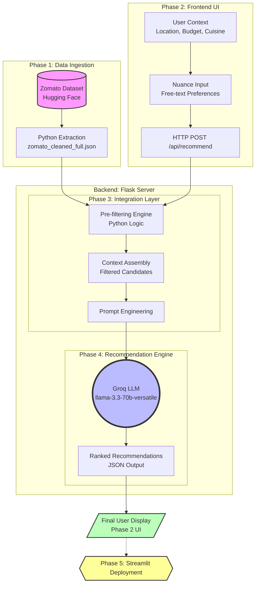

# Phase-Wise System Architecture & Workflow

## Overview Diagram

## Technology Stack
- **Frontend (Phase 2):** HTML, Vanilla CSS, Vanilla JavaScript (`fetch` API).
- **Backend (Phases 3 & 4):** Python, Flask, Flask-CORS, Groq Python SDK.
- **Data (Phase 1):** Python for data ingestion, saving state as a local JSON file (`zomato_cleaned_full.json`).

---

### Phase 1: Data Ingestion & Preprocessing (`phase1/`)
- **Source:** [Zomato Restaurant Recommendation Dataset (Hugging Face)](https://huggingface.co/datasets/ManikaSaini/zomato-restaurant-recommendation)
- **Extraction:** A Python ingestion script (`python_ingest.py`) parses and cleans structured fields: `Restaurant Name`, `Location`, `Cuisine Type`, `Average Cost`, and `User Rating`.
- **Output:** The data is transformed and saved locally as `zomato_cleaned_full.json` for rapid backend retrieval.

### Phase 2: The User Interface (`phase2/`)
The frontend client captures granular user context and displays the final results.
- **Static Context:** Target Location (e.g., Koramangala), Budget (Low, Medium, High), and Cuisine preferences.
- **Nuance Context:** Free-text vibe preferences (e.g., *"family-friendly", "rooftop seating"*).
- **Integration:** The `app.js` file bundles the context into a JSON payload and makes an HTTP POST request to the Flask backend's `/api/recommend` endpoint.

### Phase 3: The Integration Layer (`backend/phase3.py`)
The backend prepares the context for the LLM using Retrieval-Augmented Generation techniques.
1. **Pre-filtering:** The Python engine reads the JSON dataset and filters restaurants that strictly violate the location or budget constraints.
2. **Context Assembly:** The top matching candidates (sorted by rating) are formatted into a structured text list.
3. **Prompt Engineering:** A sophisticated system prompt is constructed, injecting both the user's nuanced preferences and the filtered candidate restaurant data.

### Phase 4: The Recommendation Engine (`backend/phase4.py`)
The LLM acts as the final decision-maker. 
- **Execution:** The backend uses the Groq SDK to call the `llama-3.3-70b-versatile` model.
- **Output Constraints:** The model is strictly instructed to return a valid JSON object containing:
  - **Ranked Recommendations:** The top 3-5 restaurants that perfectly align with the user's vibe.
  - **Rationale:** A concise, human-readable explanation for *why* each restaurant was chosen.
- **Delivery:** The Flask server (`backend/server.py`) returns this JSON response back to the Phase 2 frontend for display.

### Phase 5: Deployment (`frontend/streamlit/`)
The final phase involves taking the entire application stack and deploying it to the cloud for public access using Streamlit.
- **Goal:** To create a monolithic Python application (combining frontend and backend logic) that is natively supported by Streamlit Community Cloud.
- **Integration:** The backend filtering and Groq LLM API calls are imported directly into the Streamlit script, replacing the need for a separate Flask API and HTML frontend.
- **Hosting:** Deployed to Streamlit Cloud for easy, serverless hosting and sharing.
